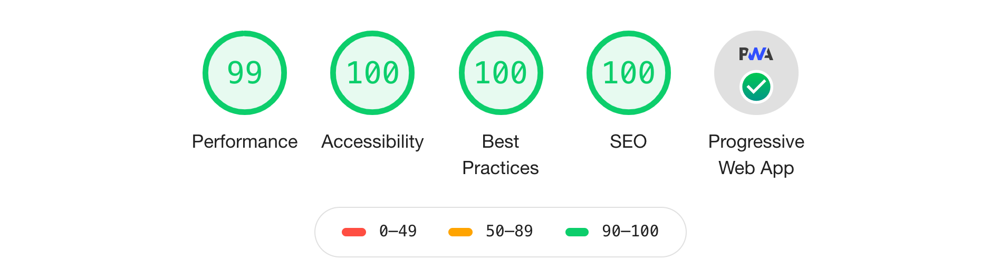

<!-- AUTO-GENERATED-CONTENT:START (STARTER) -->
<p align="center">
  <a href="https://www.bouthouri.com">
    
  </a>
</p>
<h1 align="center">
  Gatsby developer portfolio starter
</h1>

This is a ready to use starter made for developers.
It's built for high performance, blazing fast speed and SEO best practices.

## 🚀 Quickstart

1.  **Create a Gatsby site.**

    Use the Gatsby CLI to create a new site, specifying the default starter.

    ```shell
    # create a new Gatsby site using the default starter
    gatsby new gatsby-site https://github.com/bouthouri/gatsby-developer-portfolio
    ```

1.  **Start developing.**

    Navigate into your new site’s directory and start it up.

    ```shell
    cd gatsby-site/
    gatsby develop
    ```

1.  **Open the source code and start editing!**

    Your site is now running at `http://localhost:8000`!

    _Note: You'll also see a second link: _`http://localhost:8000/___graphql`_. This is a tool you can use to experiment with querying your data. Learn more about using this tool in the [Gatsby tutorial](https://www.gatsbyjs.org/tutorial/part-five/#introducing-graphiql)._

    Open the `gatsby-site` directory in your code editor of choice and edit `src/pages/*`. Save your changes and the browser will update in real-time!

## 🧐 What's inside?

A quick look at the top-level files and directories you'll see in this project.

    .
    ├── .gitignore
    ├── .prettierrc
    ├── gatsby-browser.js
    ├── gatsby-config.js
    ├── gatsby-node.js
    ├── gatsby-ssr.js
    ├── LICENSE
    ├── yarn.lock
    ├── package.json
    └── README.md
    ├── node_modules
    └── src
        ├── assets
        │   ├── images
        │   │   └── logos
        │   └── pdf
        ├── components
        │   └── styled
        ├── html.js
        ├── pages
        │   ├── 404.js
        │   ├── articles
        │   │   ├── index.js
        │   │   └── ...
        │   ├── cv.js
        │   ├── index.js
        │   ├── roadmap
        │   │   ├── index.js
        │   │   └── ...
        │   └── tutorials
        │       ├── index.js
        │       └── ...
        └── templates
            ├── article-post.js
            └── tutorial-post.js

1.  **`/src/components/pages/index`**: This is the home page file write something about yourself here.

2.  **`/src/components/header.js`**: This is the menu file that contains the main navigation menu.
    Modify this to include what page you want to access and whatnot.
    `Contact` is a mailto link.
    `CV` will open in a new tab.
    Don't forget to modify the `gatsby-node.js` accordingly.

3.  **`/src/components/pages/articles`**: This directory contains every article in an MD format. Each file will be transformed into a blog post.

4.  **`/src/components/pages/tutorials`**: This directory contains every tutorial in an MD format. Each file will be transformed into a tutorial post.

5.  **`/src/components/pages/roadmap`**: This directory contains every step of your roadmap in an MD format. Each file will be transformed into a step of the roadmap.
    The logo images are in the `/src/assets/images/logos` directory.

6.  **`/src/components/templates`**: This directory contains the automatically generated pages templates if you want to modify them.

7.  **`/src/assets`**: This directory contains files needed for the website, logo, icon, cv it's all in here.

8.  **`/src/components/styled`**: This directory contains visual component created with styled-components so if you want to change the design it's mostly here.

9.  **`gatsby-node.js`**: This file is responsible for generating the pages so if you want to delete an automatically generated page it's from here.

## 💫 Deploy

[](https://app.netlify.com/start/deploy?repository=https://github.com/bouthouri/gatsby-developer-portfolio)

<!-- AUTO-GENERATED-CONTENT:END -->
